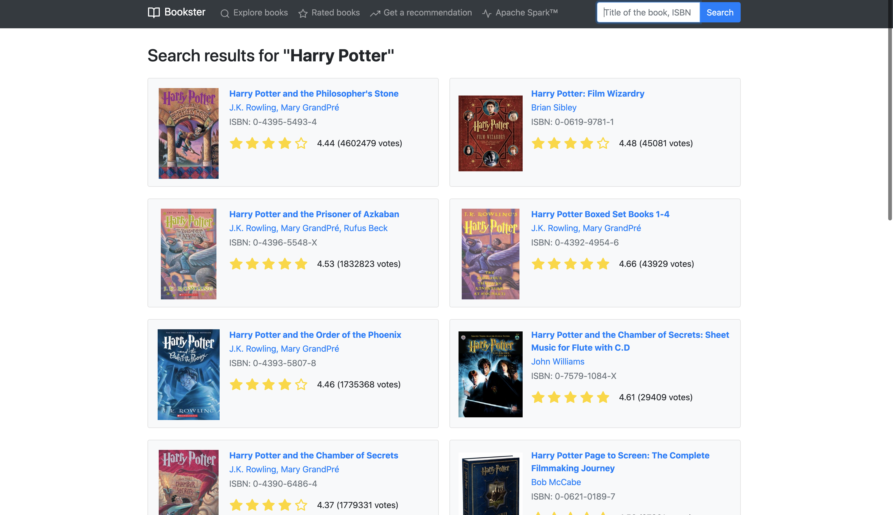
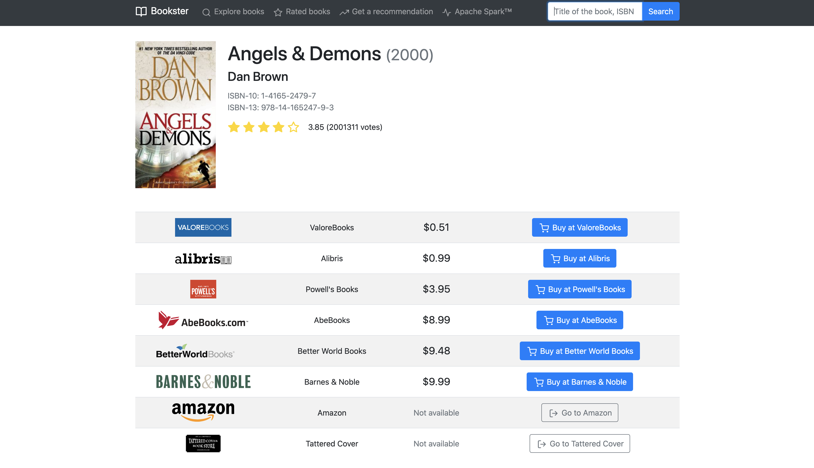
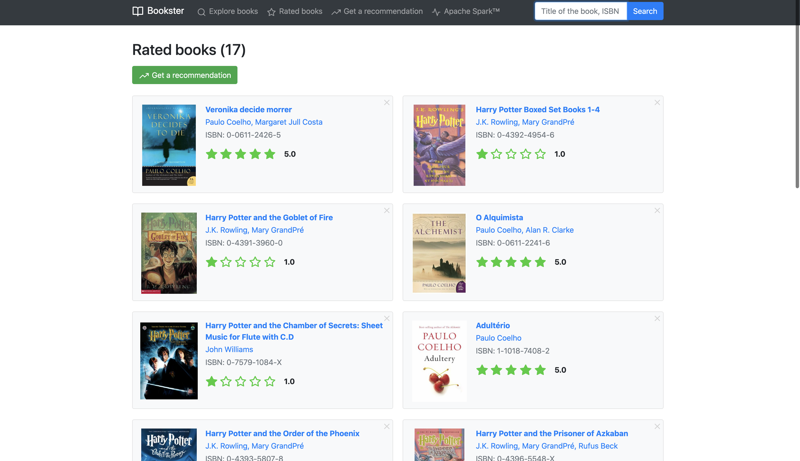
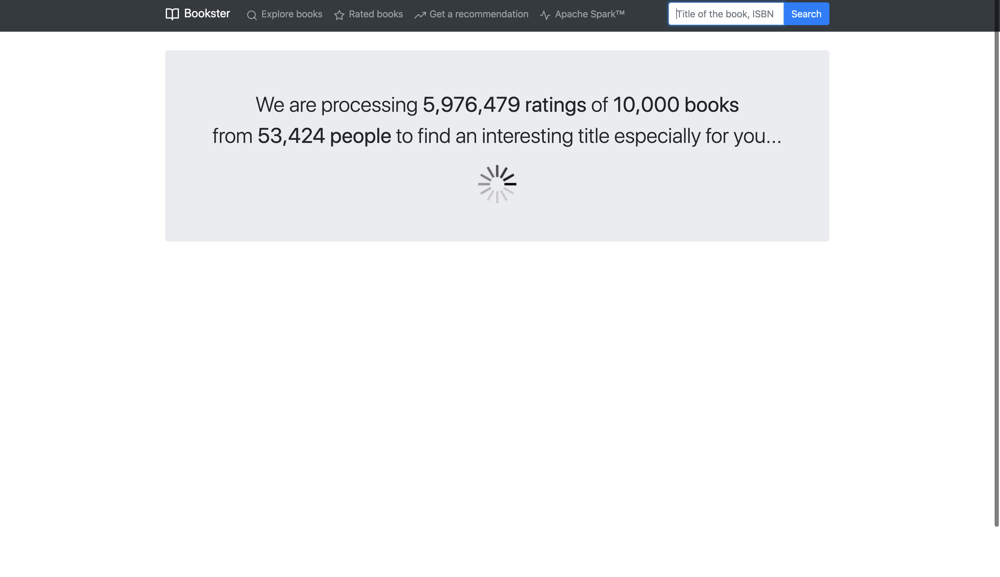
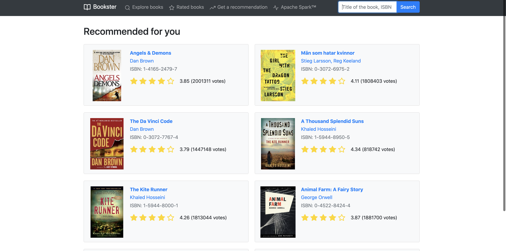

# Bookster

### Play-based web app in Scala

Web application written in Scala that allows user to explore current book prices, rate books and get
recommendations about new books based on the user rating.

The recommendation utilizes Collaborative Filtering algorithm.

Stack: Scala, Play, Spark, Bootstrap.

Books dataset source: github.com/zygmuntz/goodbooks-10k

### Main page

### Search results

### Prices dashboard

### User rating

### Loading recommendations

### Recommendations

